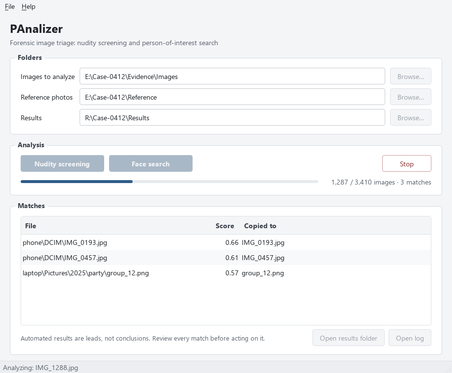

# PAnalizer

[](https://github.com/AaronSoria/PAnalizer/actions/workflows/ci.yml)
[](LICENSE)

PAnalizer is a desktop digital-forensics tool for triaging large image sets.
It helps an investigator:

- **Flag images that may contain nudity**, so they can be prioritized for
  manual review.
- **Search for a person of interest** across a folder of images, given a few
  reference photos of that person.

Matching images are listed in the application, copied to a results folder,
and recorded in a session log. PAnalizer is a triage aid: every result must be
reviewed by a person.



## Features

- **Nudity screening** with the [NudeNet](https://github.com/notAI-tech/NudeNet)
  3.x detector. An image is flagged when NudeNet detects exposed anus,
  buttocks, female breast, or female or male genitalia with a score of at
  least 0.6. All detections (class, score, box) are written to the log.
- **Person-of-interest search** with OpenCV's
  [YuNet](https://github.com/opencv/opencv_zoo/tree/main/models/face_detection_yunet)
  face detector and
  [SFace](https://github.com/opencv/opencv_zoo/tree/main/models/face_recognition_sface)
  face recognizer. Every face in a searched image is compared with every
  reference face; the image is a match when any pair has a cosine similarity
  of at least 0.363 (the threshold used in OpenCV's face recognition sample).
- **Session log** in [JSON Lines](https://jsonlines.org/) format, one per
  scan, saved in the results folder: scan settings, then one entry per
  analyzed file with the result, detections or face similarities, where it was
  copied, and any error.
- **Copies never overwrite each other.** Files with the same name get a
  `_1`, `_2`, … suffix, and copies keep the original file timestamps.
- **Desktop interface** for Windows and Linux. Scans run in the background
  with progress, image and match counts, and a Stop button. Matches are
  listed in a table with their score; **no thumbnails are shown**, so explicit
  content is only displayed when the examiner chooses to open it.
- **Recursive search** of the selected folder and its subfolders for
  `.jpg`, `.jpeg`, `.png`, `.bmp`, `.tif`, `.tiff` and `.webp` files. Paths
  with non-ASCII characters are supported.
- **Runs fully offline** once installed. No images or results leave the
  machine. No GPU is needed.

## Requirements

- Python **3.11 or newer** (tested on 3.11 and 3.13)
- Windows or Linux with a graphical desktop
- Windows only: the current
  [Microsoft Visual C++ Redistributable](https://learn.microsoft.com/cpp/windows/latest-supported-vc-redist)
  (2015–2022, x64), required by ONNX Runtime
- Python packages (pinned in [`requirements.txt`](requirements.txt)):
  `nudenet`, `onnxruntime`, `opencv-python-headless`, `numpy`, `PyQt5`
- About 40 MB of face models, downloaded once during installation (see below)

## Installation

Use a **new** virtual environment. No administrator rights are needed.

### Linux

```bash
git clone https://github.com/AaronSoria/PAnalizer.git
cd PAnalizer
python3 -m venv .venv
. .venv/bin/activate
python install_linux.py
```

On minimal installations Qt may need extra system libraries. On
Debian/Ubuntu:

```bash
sudo apt-get install libgl1 libglib2.0-0 libegl1 libxkbcommon0 libfontconfig1
```

### Windows

```bat
git clone https://github.com/AaronSoria/PAnalizer.git
cd PAnalizer
py -3 -m venv .venv
.venv\Scripts\activate
python install_windows.py
```

### What the installer does

1. `pip install -r requirements.txt`
2. `python download_models.py`: downloads the YuNet and SFace models from the
   [OpenCV Model Zoo](https://github.com/opencv/opencv_zoo) into `models/` and
   checks each file against a pinned SHA-256 hash. The NudeNet model is
   included in the `nudenet` package.

**Offline machines:** on a connected machine, download the two files listed in
`download_models.py`, copy them into `models/` on the offline machine, and run
`python download_models.py` there to verify them.

### Upgrading from v1

v2 replaces `opencv-contrib-python` with `opencv-python-headless`. The two
conflict if installed together, so create a new virtual environment instead of
upgrading the old one.

## Usage

```bash
python PAnalizer.py
```

Choose the folders in the **Folders** section (type a path or use **Browse…**):

| Field | Used by | Purpose |
|---|---|---|
| Images to analyze | both | Images to analyze (subfolders included) |
| Reference photos | Face search | Photos of the person of interest |
| Results | both | Where matching images and the session log are saved |

Then start an analysis:

- **Nudity screening** needs the images and results folders.
- **Face search** also needs the reference photos. Use several clear photos
  where the person's face is visible. From each reference photo, the face
  detected with the highest confidence is used; subfolders of the reference
  folder are not read. If no face is detected in any reference photo, a
  warning is shown and the search does not start.

The images and results folders must be different. While a scan runs, the
progress bar shows how many images have been analyzed and how many matched.
**Stop** ends the scan after the current image (closing the window does the
same); the log records that it was stopped.

Matches appear in the **Matches** table: the file (relative to the analyzed
folder; hover for the full path), its score, and the name of the copy in the
results folder. The score is the highest explicit-content detection score
(nudity screening, 0–1) or the highest similarity to the reference faces
(face search). **Open results folder** and **Open log** (also in the File
menu) open them with the system's default application.

**Remembered folders.** The last folders used are restored when PAnalizer
starts. They are stored in a plain text file, `%APPDATA%\PAnalizer\PAnalizer.ini`
on Windows or `~/.config/PAnalizer/PAnalizer.ini` on Linux. Use
**File › Forget recent folders** to delete them, for example before handing
the machine to another examiner.

**Help › About PAnalizer** shows the version, license and third-party
licenses.

## Project structure

```
PAnalizer.py                      Entry point: starts the Qt application
ViewModels/PAnalizerViewModel.py  Main window and background scan workers
Views/PAnalizerView.ui            Qt Designer layout
Views/PAnalizerView_ui.py         Python code generated from the .ui file (pyuic5)
Views/style.qss                   Interface style sheet (colors, spacing)
docs/screenshot.png               Screenshot used in this README
Libs/ImageScanner.py              Nudity detection, face detection/recognition, copies, log
download_models.py                Downloads and verifies the face models
install_linux.py, install_windows.py  Install dependencies and models
models/                           Face models (downloaded, not in git)
tests/                            Unit and smoke tests (no GPU or real photos required)
```

## Limitations

Read these before relying on any result.

- **Accuracy has not been measured** on any dataset for this tool. Both
  models produce false positives and false negatives; validate them on data
  representative of your cases.
- **Fixed thresholds.** The nudity score threshold (0.6), the face similarity
  threshold (0.363) and the face detection confidence (0.7) are set in
  `Libs/ImageScanner.py` and cannot be changed from the interface.
- **Small details can be missed.** NudeNet analyzes images at 320 pixels, and
  face detection runs on images reduced to at most 1280 pixels on their longest
  side, so small or distant people and faces may not be detected.
- **Face recognition is sensitive** to pose, lighting, resolution, occlusion
  and age differences, and face recognition accuracy can differ between
  demographic groups.
- **Evidence integrity.** Copies keep file timestamps and the log records
  every result, but PAnalizer does not compute file hashes or provide chain of
  custody. Work on a forensic copy of the data, never on the original evidence.

## Responsible use

PAnalizer is intended for lawful forensic and investigative work, such as
law-enforcement or corporate investigations and content-moderation triage,
carried out by authorized people.

- Use it only on data you are legally authorized to examine, and follow the
  laws and procedures of your jurisdiction, including privacy and
  data-protection law. Face recognition is regulated or restricted in some
  jurisdictions.
- Do not use it to surveil, identify or track people without a legal basis.
- Automated results are leads, not conclusions. Have every match confirmed
  by a qualified person before acting on it.
- If you encounter child sexual abuse material, do not copy or share it;
  report it to the competent authorities (for example NCMEC or your national
  hotline listed by INHOPE).

## License

PAnalizer is free software, licensed under the
[GNU Affero General Public License v3.0 or later](LICENSE).
Copyright (C) 2019-2026 Aaron Soria.

Versions up to and including v1.0.0 were released under the MIT License.

Third-party components:

| Component | Used for | License |
|---|---|---|
| [NudeNet](https://github.com/notAI-tech/NudeNet) (code and bundled model) | Nudity detection | AGPL-3.0 |
| [YuNet](https://github.com/opencv/opencv_zoo/tree/main/models/face_detection_yunet) model | Face detection | MIT |
| [SFace](https://github.com/opencv/opencv_zoo/tree/main/models/face_recognition_sface) model | Face recognition | Apache-2.0 |
| [OpenCV](https://opencv.org/) | Image processing, face models runtime | Apache-2.0 |
| [ONNX Runtime](https://onnxruntime.ai/) | NudeNet model runtime | MIT |
| [PyQt5](https://www.riverbankcomputing.com/software/pyqt/) | User interface | GPL-3.0 |

## Contributing

Bug reports and pull requests are welcome. See
[CONTRIBUTING.md](CONTRIBUTING.md) for the development setup, and never attach
explicit images to issues.
